# Restaurant Simulation with Multi-Agent Systems: Blackboard Pattern Implementation on JaCaMo Platform

**Project Team:** 4 People  
**Platform:** JaCaMo (Jason + CArtAgO + Moise)  
**Date:** January 2026

---

## 1. Introduction

One of the most exciting developments in artificial intelligence today is multiple autonomous software agents working together to accomplish complex tasks. Multi-agent systems are used in many areas, from baggage handling systems at airports to smart factory production lines. In this project, we modeled a restaurant environment with multi-agent systems, delegating the roles of waiter, cook, cashier, and customer to autonomous software agents.

The main objective of our project is to create a real-time restaurant simulation using the JaCaMo platform and implement the Blackboard design pattern for the order prioritization problem. In our developed system, orders are sorted by value score, thus optimizing restaurant profitability.

### 1.1 Problem Definition

Traditional restaurant management systems rely on centralized control logic. However, in a real restaurant, waiters, cooks, and cashiers work by making independent decisions. Multi-agent architecture is ideal for modeling this distributed structure in software. In our project, we sought answers to the following questions:

- How can autonomous agents work in coordination?
- What criteria should be used to prioritize orders?
- How can consistency be maintained in a system without centralized control?

### 1.2 Scope

This study consists of four types of agents (waiter, cook, cashier, customer), four artifacts (table manager, order board, kitchen, cash register), and an organizational structure. The system runs in a Docker container and can be monitored in real-time via a web interface.

---

## 2. Literature Review

### 2.1 Multi-Agent Systems

According to Wooldridge and Jennings' (1995) definition, a software agent is an entity that perceives its environment, makes autonomous decisions, and transforms these decisions into actions. Multi-agent systems are systems where multiple agents interact towards a common goal.

The concept of Agent-Oriented Programming was first proposed by Shoham (1993). Shoham suggested modeling software units with beliefs, desires, and intentions (BDI - Belief-Desire-Intention), going beyond traditional object-oriented programming.

### 2.2 JaCaMo Platform

JaCaMo is an integrated multi-agent development platform that combines three fundamental technologies:

**Jason:** An AgentSpeak(L) interpreter based on Rao and Georgeff's BDI architecture. It is used to define agents' beliefs, goals, and plans (Bordini et al., 2007).

**CArtAgO:** A framework that defines environment objects (artifacts) with which agents interact. Developed by Ricci and colleagues (2009). Artifacts provide access to shared resources.

**Moise:** An organizational modeling tool developed by Hübner and colleagues (2002). It defines the social structure between agents through roles, groups, and norms.

### 2.3 Blackboard Design Pattern

The Blackboard pattern is a problem-solving approach formalized by Nii (1986). In this pattern:

1. There is a central data repository (blackboard)
2. Expert agents observe this board
3. When appropriate conditions arise, an agent takes data from the board and processes it
4. Results are written back to the board

This pattern has been used in classic artificial intelligence applications such as the HEARSAY-II speech recognition system. In our project, the OrderBoard artifact assumes the blackboard role.

### 2.4 Prioritization Algorithms

Job sequencing problems have been comprehensively studied in operations research literature. The Weighted Shortest Job First (WSJF) algorithm was popularized by SAFe (Scaled Agile Framework). In this algorithm, for each job:

```
WSJF = (Job Value) / (Job Duration)
```

is calculated, and jobs with high scores are done first. In our project, we adapted this approach to order prioritization.

---

## 3. Developed Approach

### 3.1 System Architecture

Our developed system has a three-layer architecture:

```mermaid
flowchart TB
    subgraph UI["🖥️ User Interface"]
        SIM[simulation.html]
        API[REST API]
    end
    
    subgraph AGENTS["🤖 Agent Layer"]
        W[Waiter Agent]
        C[Cook Agent]
        CA[Cashier Agent]
        CU[Customer Agent]
    end
    
    subgraph ARTIFACTS["📦 Artifact Layer"]
        OB[OrderBoard<br/>Blackboard]
        TM[TableManager]
        K[Kitchen]
        CR[CashRegister]
    end
    
    subgraph ORG["🏛️ Organization"]
        MOISE[Moise<br/>Roles and Norms]
    end
    
    SIM -->|HTTP| API
    API -->|ACL Message| W
    
    W <-->|observe/operate| OB
    W <-->|operate| TM
    W <-->|operate| CR
    
    C <-->|poll/update| OB
    C <-->|operate| K
    
    CA <-->|operate| CR
    
    CU -->|order| W
    
    MOISE -.->|norm| W
    MOISE -.->|norm| C
    MOISE -.->|norm| CA
```



### 3.2 Order Management with Blackboard Pattern

The most important contribution of our project is the use of the OrderBoard artifact as a Blackboard pattern. In this approach:

1. **Writing:** The waiter agent records the order received from the customer to the OrderBoard
2. **Reading:** The cook agent periodically checks the queue
3. **Prioritization:** Orders are sorted by value score
4. **Updating:** Status is updated when cooking is completed

Thanks to this architecture, the waiter and cook can work independently of each other.

### 3.3 Value Score Algorithm

The value score for each order is calculated using the following formula:

```
Value Score = Price ($) / Cooking Time (seconds)
```

Example calculation:

| Food | Price | Time | Value Score | Priority |
|------|-------|------|-------------|----------|
| Steak | $45 | 17s | **2.65** | 1 |
| Pizza | $25 | 15s | **1.67** | 2 |
| Pasta | $20 | 14s | **1.43** | 3 |
| Burger | $18 | 13s | **1.38** | 4 |
| Salad | $12 | 12s | **1.00** | 5 |

Thanks to this algorithm, orders that provide the highest revenue in the same time are prepared first.

### 3.4 Agent Communication Flow

The following flow diagram shows the process from receiving an order to completing payment:


### 3.5 User Interface

Users can monitor the system status in real-time with the web-based simulation interface.

**Menu and Order Panel:**


The interface consists of three main sections:
- **Left Panel:** Menu selection and ordering
- **Center Panel:** Agent activity logs
- **Right Panel:** Order queue visualization

**Order Queue Visualization:**

The queue is displayed in three columns:
- ⏳ **Pending Orders:** Sorted by value score
- 🔥 **Cooking:** Currently cooking order
- ✅ **Completed:** Recently completed orders

### 3.6 Deployment with Docker

The system can be started with a single command using the following Docker Compose structure:

```yaml
services:
  jacamo:
    build: .
    ports:
      - "8080:8080"
  nginx:
    image: nginx:alpine
    volumes:
      - ./simulation.html:/usr/share/nginx/html/simulation.html
```

Thanks to Gradle wrapper cache optimization, restarts after the initial build are completed within seconds.

---

## 4. Evaluation

### 4.1 Functional Tests

The following test scenarios were applied to verify that the system works correctly:

| Test | Input | Expected Output | Result |
|------|-------|-----------------|--------|
| Order Recording | Pizza order | pendingOrders: 1 | ✅ Successful |
| Prioritization | Steak + Salad | Steak should cook first | ✅ Successful |
| Synchronous Cooking | 3 orders | Sequential processing | ✅ Successful |
| Web Update | Place order | Queue updates | ✅ Successful |

### 4.2 Performance Evaluation

**Build Times:**
- Initial build (Gradle download): ~4 minutes
- Subsequent builds (cache): ~3 seconds

**API Response Times:**
- OrderBoard status: <100ms
- Order submission: <200ms

### 4.3 Challenges Encountered

Some technical challenges were experienced during development:

1. **Artifact Name Conflict:** Kitchen and OrderBoard artifacts had operations with the same name (`startCooking`). CArtAgO was calling the operation of the first artifact found. As a solution, Kitchen operations were renamed to `kitchenStartCooking`.

2. **String-Atom Incompatibility:** String values returned from Java artifacts did not match atom beliefs in Jason. Conversion was provided with the `.term2string()` internal action.

3. **Asynchronous Queue Processing:** The Cook agent was taking multiple orders simultaneously. Sequential processing was ensured with a synchronous processing loop.

### 4.4 System Strengths

- **Modularity:** Each agent can be developed independently
- **Extensibility:** Easy to add new food or agents
- **Observability:** Real-time monitoring via web interface
- **Portability:** Works in any environment thanks to Docker

### 4.5 Limitations

- Sequential processing with a single cook, parallel cooking is not supported
- Customer behaviors are predefined, there is no learning mechanism
- Computational complexity analysis was not performed

---

## 5. Conclusion

In this project, a multi-agent system simulating a restaurant environment was developed using the JaCaMo platform. The main contributions of the system are:

1. **Blackboard Pattern Implementation:** The OrderBoard artifact was designed as a central coordination point and the Blackboard pattern was successfully implemented.

2. **Value-Based Prioritization:** Inspired by the WSJF algorithm, orders are sorted based on profitability using the developed value score formula.

3. **JaCaMo Integration:** The integrated use of Jason, CArtAgO, and Moise components was demonstrated.

4. **Web-Based Monitoring:** Real-time system status is presented via REST API and dynamic interface.

### 5.1 Future Work

Our project can be improved in various ways:

- **Parallel Cooking:** Simultaneous order processing with multiple cook agents
- **Machine Learning:** Learning models that predict customer behaviors
- **Dynamic Pricing:** Price adjustment mechanism based on demand
- **Distributed Deployment:** Scalable architecture with Kubernetes

---

## 6. References

1. Bordini, R. H., Hübner, J. F., & Wooldridge, M. (2007). *Programming Multi-Agent Systems in AgentSpeak using Jason*. John Wiley & Sons.

2. Hübner, J. F., Sichman, J. S., & Boissier, O. (2002). Moise+: towards a structural, functional, and deontic model for MAS organization. *Proceedings of AAMAS*, 501-502.

3. Nii, H. P. (1986). Blackboard systems: The blackboard model of problem solving and the evolution of blackboard architectures. *AI Magazine*, 7(2), 38-53.

4. Rao, A. S., & Georgeff, M. P. (1995). BDI agents: From theory to practice. *Proceedings of ICMAS*, 312-319.

5. Ricci, A., Piunti, M., & Viroli, M. (2011). Environment programming in multi-agent systems: an artifact-based perspective. *Autonomous Agents and Multi-Agent Systems*, 23(2), 158-192.

6. Shoham, Y. (1993). Agent-oriented programming. *Artificial Intelligence*, 60(1), 51-92.

7. Wooldridge, M., & Jennings, N. R. (1995). Intelligent agents: Theory and practice. *The Knowledge Engineering Review*, 10(2), 115-152.

8. Boissier, O., Bordini, R. H., Hübner, J. F., Ricci, A., & Santi, A. (2013). Multi-agent oriented programming with JaCaMo. *Science of Computer Programming*, 78(6), 747-761.

---

## Appendices

### Appendix A: System Flow Diagram


### Appendix B: Project File Structure

```
jacamo-web-demo-marketplace-master/
├── src/
│   ├── agt/          # Agent code (ASL)
│   │   ├── waiter.asl
│   │   ├── cook.asl
│   │   ├── cashier.asl
│   │   └── customer.asl
│   ├── env/          # Artifacts (Java)
│   │   └── restaurant/
│   │       ├── OrderBoard.java
│   │       ├── Kitchen.java
│   │       ├── TableManager.java
│   │       └── CashRegister.java
│   └── org/          # Organization
│       └── restaurant.xml
├── simulation.html   # Web interface
├── restaurant.jcm    # JaCaMo configuration
├── docker-compose.yml
└── Dockerfile
```

---

**Note:** This report was prepared by a project team of 4 people.
